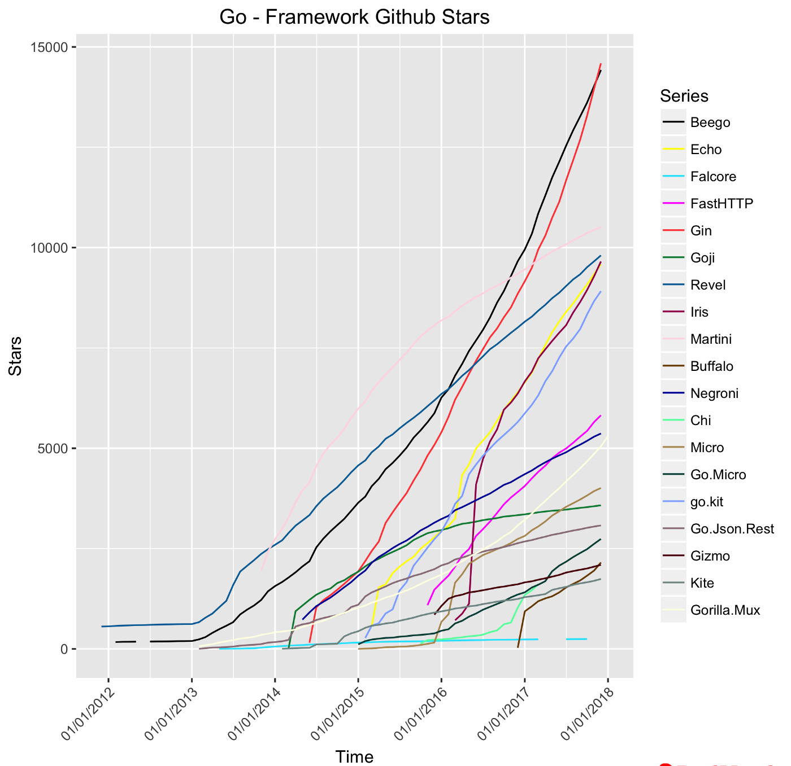

Yesterday I rewrote the entire application from Gorilla / Mux to Gin. Why rewritten? Because Mux has been looking for a new maintainer for almost 2 years now. Well, in searches with Mux, Gin is considered one of the fastest: 

Gin is actively development and it's has locked api. No new library releases will affect your application.

In the future, you need to be more attentive to such things. A library that is no longer supported cannot be used in your projects.
